# Tag Series Full Flow Diagram

Copy and paste this Mermaid chart into any Mermaid-compatible editor or documentation tool.

```mermaid
flowchart TD
  P0([User enters AtomX portal])
  P0 --> P1["Portal auth/token exists"]
  P1 --> P2["User selects Tag Series role"]
  P2 --> P3["POST /auth/select<br/>credentials: include<br/>role/admin context"]
  P3 --> P4["Store app token if available<br/>localStorage: atomx.auth.tag-series"]
  P4 --> A([Open /tag_series])

  A --> B["Root layout<br/>PostHogInit('tag_series')<br/>TokenGate(appId='tag-series')"]

  B --> C{Route is /login?}
  C -->|yes| L1["UniversalLoginPage<br/>appId='tag-series'"]
  L1 --> L2["GET auth URL<br/>BASE_URL/auth/google/start<br/>?app=tag-series&redirect=origin"]
  L2 --> L3["Google login"]
  L3 --> L4["Redirect back with ?token=JWT"]
  L4 --> L5["decodeJwt(token)"]
  L5 --> L6["Save token<br/>localStorage: atomx.auth.tag-series"]
  L6 --> L7["Remove token from URL"]
  L7 --> A

  C -->|no| T0["TokenGate current behavior<br/>removes ?token if present<br/>does not enforce login redirect"]

  T0 --> S1["Step 1: /tag_series/"]
  S1 --> S2["Read token<br/>atomx.auth.tag-series<br/>fallback/migrate atomx.auth.tag_series"]
  S2 --> S3["Read saved setup<br/>sessionStorage: atomx.tag_series.step1"]

  S2 --> API1["GET /v1/TagSeries/Events<br/>headers: x-api-key<br/>credentials: include"]
  S2 --> API2["GET /v1/TagSeries/CardClients<br/>headers: x-api-key<br/>credentials: include"]

  API1 --> S4["Normalize events list"]
  API2 --> S5["Normalize client list"]
  S3 --> S6["Prefill event/year/client if saved"]
  S4 --> S7["User selects Event"]
  S5 --> S8["User selects Client"]
  S6 --> S9["User enters Year Series"]

  S7 --> SUB1["User clicks Continue"]
  S8 --> SUB1
  S9 --> SUB1

  SUB1 --> V1{Valid event + client?}
  V1 -->|no| E1["Show validation error"]
  V1 -->|yes| API3["GET /v1/TagSeries/Series<br/>eventId + adminId + yearSeries"]

  API3 --> S10["Read tagSeries_last"]
  S10 --> S11["Compute nextSeries<br/>pad2(last + 1)"]
  S11 --> S12["Save setup<br/>eventId, yearSeries, clientId,<br/>clientName, clientSeries, eventSeries"]
  S12 --> S13["PostHog<br/>identify user<br/>operation_event_setup_submitted"]
  S13 --> G0["router.push('/generate?c=eventId')"]

  S1 --> ADM0["Admin menu"]
  ADM0 --> ADM1["/Admin/View<br/>Static records table<br/>no API action"]
  ADM0 --> ADM2["/Admin/AddFormFactor<br/>UI form only<br/>no submit API"]
  ADM0 --> ADM3["/Admin/AddProduct<br/>UI form only<br/>no submit API"]

  G0 --> G1["Generate page<br/>/tag_series/generate?c=eventId"]
  G1 --> G2{eventId is digits?}
  G2 -->|no| GERR0["router.replace('/')"]
  G2 -->|yes| G3["Read sessionStorage setup"]
  G3 --> G4{Saved eventId matches URL eventId?}
  G4 -->|no| GERR1["Missing client meta<br/>cannot submit"]
  G4 -->|yes| G5["Set clientMeta<br/>prefill yy, brand, series"]

  G5 --> API4["GET /v1/TagSeries/BatchRecords<br/>eventId + adminId"]
  API4 --> G6["Normalize batch records<br/>sort newest<br/>show last 4"]

  G5 --> API5["GET /v1/TagSeries/Series<br/>eventId + adminId + yy"]
  API5 --> G7["Refresh series map"]

  G5 --> G8["User selects form factor"]
  G8 --> G9["User enters quantity"]
  G9 --> G10["Auto-calculate extraQty<br/>Card/Tag: round to 28<br/>Accred: round to 16<br/>others: 0"]
  G10 --> G11["User enters optional note"]
  G11 --> SUB2["User clicks Generate"]

  SUB2 --> V2{Validate generate form}
  V2 -->|no| E2["Show error<br/>yy, brand, series, qty,<br/>extraQty, note length"]
  V2 -->|yes| PLOAD["Build payload<br/>eventId, adminId, yearSeries,<br/>scanType='tagQR', formFactor,<br/>product=1, requestId,<br/>userPseudoId, count, batchNote, spare"]

  PLOAD --> API6["POST /v1/TagSeries/Logs<br/>headers: x-api-key + Content-Type<br/>credentials: include<br/>body: payload"]
  API6 --> R1{Response has logs + series?}
  R1 -->|no| E3["Show API/response error"]
  R1 -->|yes| R2["For each log:<br/>find seriesMeta by eventwiseId"]
  R2 --> R3["Build prefix<br/>yearSeries + brand + series"]
  R3 --> R4["Build startTag/endTag<br/>prefix + 5-digit serial"]
  R4 --> R5["Build redirect URLs<br/>https://tags.atomx.in/redirect/v1<br/>scanType=QR&f=formType&p=1&c=eventId&tag=tag"]
  R5 --> R6["Show generated ranges"]
  R6 --> R7["PostHog<br/>operation_tag_batch_generated"]
  R7 --> API4

  R6 --> X1["User clicks Download Excel"]
  X1 --> X2{Include URLs?}
  X2 -->|yes| X3["Rows:<br/>Final Series + URL"]
  X2 -->|no| X4["Rows:<br/>Final Series only"]
  X3 --> X5["For every serial:<br/>tag = prefix + serial"]
  X4 --> X5
  X5 --> X6["Calculate 2-digit checksum<br/>(sumDigits^2 - lastDigit) % 100"]
  X6 --> X7["Final Series format<br/>tag / checksum"]
  X7 --> X8["XLSX.writeFile<br/>FormLabel-Series minTag to maxTag.xlsx"]
  X8 --> X9["PostHog<br/>operation_tag_excel_downloaded"]

  NOTE["API helper behavior<br/>BASE_URL = NEXT_PUBLIC_BASE_URL or dapi.atomx.in<br/>x-api-key from env/fallback<br/>token is read from localStorage but is not sent as Authorization"]
  S2 -.-> NOTE
  API1 -.-> NOTE
  API2 -.-> NOTE
  API3 -.-> NOTE
  API4 -.-> NOTE
  API5 -.-> NOTE
  API6 -.-> NOTE
```

## Current-Code Notes

- `TokenGate` currently removes a token from the URL if present, then renders the app. It does not currently force a redirect to login when no token exists.
- Tag Series API helpers read the local token, but the token is not sent as an `Authorization` header. Requests use `x-api-key` and `credentials: include`.
- `/Admin/View`, `/Admin/AddFormFactor`, and `/Admin/AddProduct` are currently static/UI-only flows with no connected submit API.
